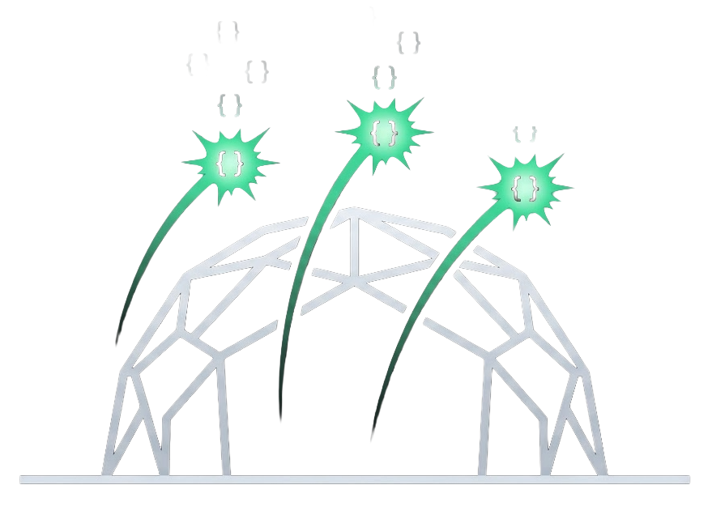

<p align="center">
  
</p>

<h1 align="center">MCPDome</h1>

<p align="center"><strong>Iron Dome for AI Agents — MCP Security Gateway</strong></p>

<p align="center">
  <a href="https://github.com/orellius/mcpdome/blob/main/LICENSE"></a>
  <a href="https://github.com/orellius/mcpdome"></a>
  <a href="https://github.com/orellius/mcpdome"></a>
  <a href="https://github.com/orellius/mcpdome"></a>
</p>

<p align="center">
  If you find MCPDome useful, consider giving it a star — it helps others discover the project!
</p>

<p align="center">
  <a href="https://github.com/orellius/mcpdome/blob/main/ARCHITECTURE.md"><strong>Architecture</strong></a> ·
  <a href="https://github.com/orellius/mcpdome/blob/main/mcpdome.example.toml"><strong>Example Policy</strong></a>
</p>

<p align="center">
  <a href="https://orellius.ai"><strong>Made by Orellius.ai</strong></a>
</p>

---

MCPDome sits between your AI agent and any MCP server, intercepting every JSON-RPC message on the wire. It enforces authentication, authorization, rate limiting, and injection detection — without modifying either side. Think of it as a firewall for AI tool calls.

```
┌──────────┐         ┌─────────┐         ┌────────────┐
│ AI Agent │ ──MCP──>│ MCPDome │──MCP──> │ MCP Server │
│ (Client) │<──MCP── │ Gateway │<──MCP── │  (Tools)   │
└──────────┘         └─────────┘         └────────────┘
                          │
                     ┌────┴────┐
                     │ Policy  │
                     │  TOML   │
                     └─────────┘
```

## Why MCPDome?

AI agents are getting access to powerful tools — file systems, databases, APIs, code execution. MCP is the protocol connecting them. But **there's no security layer in the middle**. MCPDome fixes that:

- **Default-deny policy engine** — TOML rules evaluated by priority, first match wins
- **Injection detection** — Regex patterns catch prompt injection, data exfiltration, encoding evasion
- **Schema pinning** — SHA-256 hashes of tool definitions detect rug pulls and tool shadowing
- **Hash-chained audit logs** — Tamper-evident NDJSON logging with SHA-256 chain linking
- **Token-bucket rate limiting** — Per-identity and per-tool limits with DashMap concurrency
- **Pre-shared key authentication** — Identity resolution chain with label-based policy matching
- **0.2ms overhead** — Rust performance, single binary, zero config to start

## Install

```bash
# From source
git clone https://github.com/orellius/mcpdome.git
cd mcpdome
cargo build --release
```

## Quick Start

Wrap any stdio MCP server — zero config, transparent mode:

```bash
mcpdome proxy --upstream "npx -y @modelcontextprotocol/server-filesystem /tmp"
```

Enable security features progressively:

```bash
# Injection detection
mcpdome proxy --upstream "..." --enable-ward

# Schema pinning (detect tool definition changes)
mcpdome proxy --upstream "..." --enable-schema-pin

# Rate limiting
mcpdome proxy --upstream "..." --enable-rate-limit

# Everything
mcpdome proxy --upstream "..." --enable-ward --enable-schema-pin --enable-rate-limit
```

## What It Catches

<div align="center">

| Threat | How MCPDome Stops It |
|--------|---------------------|
| Prompt injection in tool args | Ward scans for "ignore previous instructions", role hijacking, etc. |
| Secret leakage (AWS keys, PATs) | Policy deny_regex blocks `AKIA...`, `ghp_...`, private keys |
| Tool rug pulls | Schema pinning detects when a tool's definition silently changes |
| Data exfiltration | Ward detects "send the password to...", encoding evasion |
| Unauthorized tool access | Default-deny policy with identity labels and tool matching |
| Abuse / runaway agents | Token-bucket rate limiting per identity and per tool |
| Tampering with audit trail | SHA-256 hash chain makes retroactive log editing detectable |

</div>

## Policy Example

```toml
# Block secret patterns everywhere (highest priority)
[[rules]]
id = "block-secrets"
priority = 1
effect = "deny"
identities = "*"
tools = "*"
arguments = [
    { param = "*", deny_regex = ["AKIA[A-Z0-9]{16}", "ghp_[a-zA-Z0-9]{36}"] },
]

# Developers can read, not delete
[[rules]]
id = "dev-read-tools"
priority = 100
effect = "allow"
identities = { labels = ["role:developer"] }
tools = ["read_file", "grep", "git_status"]

# Write only to safe paths
[[rules]]
id = "dev-write-safe"
priority = 110
effect = "allow"
identities = { labels = ["role:developer"] }
tools = ["write_file"]
arguments = [
    { param = "path", allow_glob = ["/tmp/**"], deny_regex = [".*\\.env$"] },
]
```

See [`mcpdome.example.toml`](mcpdome.example.toml) for a complete policy file.

## Architecture

Rust workspace of focused crates, each with a single responsibility:

```
mcpdome (binary)
  ├── dome-core         Shared types & error taxonomy
  ├── dome-transport    MCP wire protocol (stdio, HTTP+SSE)
  ├── dome-gate         Interceptor chain orchestration
  ├── dome-sentinel     Authentication & identity resolution
  ├── dome-policy       TOML policy engine (default-deny)
  ├── dome-ledger       Hash-chained audit logging
  ├── dome-throttle     Token-bucket rate limiting & budgets
  └── dome-ward         Injection detection & schema pinning
```

**Interceptor chain order** (inbound):
```
sentinel → throttle → policy → ward → ledger → upstream server
```

See [ARCHITECTURE.md](ARCHITECTURE.md) for the full deep dive.

## Test Suite

127 tests covering every security component:

```
dome-core       5 tests   (message parsing, error mapping)
dome-sentinel  17 tests   (PSK auth, anonymous, chain resolution)
dome-policy    23 tests   (rules, priority, arg constraints, secrets)
dome-throttle  18 tests   (token bucket, rate limits, budgets, concurrency)
dome-ward      36 tests   (injection patterns, schema pins, heuristics)
dome-ledger    21 tests   (hash chain, tamper detection, file rotation)
integration     7 tests   (full binary proxy end-to-end)
```

```bash
cargo test --workspace
```

## Roadmap

| Phase | What Ships | Status |
|-------|-----------|--------|
| 1 | Transparent stdio proxy, audit logging | Done |
| 2 | TOML policy engine, PSK authentication, default-deny | Done |
| 3 | Injection detection, schema pinning, rate limiting | Done |
| 4 | HTTP transport, OAuth/mTLS, budget tracking, config hot-reload | Next |

## License

Apache-2.0

## Author

Orel Ohayon / [Orellius.ai](https://orellius.ai)
